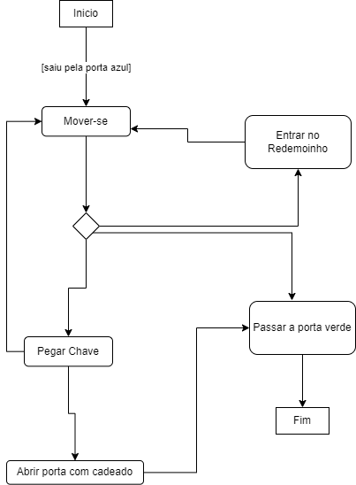
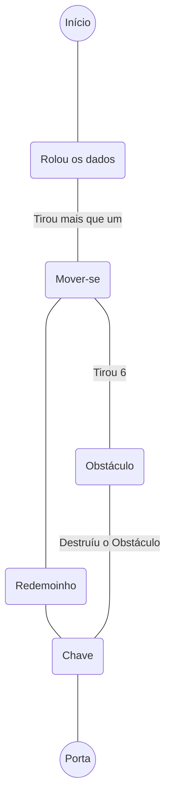

# Jogo: **Atrás da Porta Verde**

## Súmario executivo

### Descrição do Sistema
Jogo de `tabuleiro`. Um `jogador`. Um objetivo. Duas maneiras de chegar ao objetivo. O objetivo é chegar até a `porta de saída` (Porta Verde). O Jogo é composto por `obstáculos` e `portais`. `O personagem não pode se movimentar para frente`. O tabuleiro é disposto verticalmente em quadrantes - tamanho 6x5. O jogador se move com comandos pré estabelecidos. Ele inicia o jogo na posição linha 1, quadrado 3 (l1,q3), virado para frente do tabuleiro. Há uma `porta de entrada` (Porta Azul) e uma porta de saída. Para alcançar o objetivo o jogador pode ir até a porta verde ou tentar alcançar a `chave` e abrir a `porta com cadeado`. 

---
### Atores
- Jogador

### Objetos/Componentes
- Porta Azul (Entrada)
- Porta Verde (Saída)
- Porta com cadeado
- Chave
### Obstáculos
- Barris
- Cercas
### Portais
- Redemoinhos
---
## Diagrama de Atividades

```mermaid
flowchart TB
    A((Inicio))
    B(Mover-se)
    C{fa:fa-blank}
    D(Pegar Chave)
    E(Abrir Porta com Cadeado)
    F(Entrar no Redemoinho)
    G(Passar a Porta Verde)
    H((Fim))
    A ---> |saiu pela porta azul|B ----- C ---- D ---- E ---- G ---- H
    F ---- B & G
    C -----> F & G
    style A fill:#FFFFFF,stroke:#000000
    style B fill:#FFFFFF,stroke:#000000
    style C fill:#000000,stroke:#000000
    style D fill:#FFFFFF,stroke:#000000
    style E fill:#FFFFFF,stroke:#000000
    style F fill:#FFFFFF,stroke:#000000
    style G fill:#FFFFFF,stroke:#000000
    style H fill:#FFFFFF,stroke:#000000
```

```mermaid
flowchart TB
    A[Inicio]
    B(Mover-se)
    C{fa:fa-blank}
    D(Pegar Chave)
    E(Abrir Porta com Cadeado)
    F(Entrar no Redemoinho)
    G(Passar a Porta Verde)
    H[Fim]
    A --> |saiu pela porta azul|B --- C --- D --- E ---- G --- H
    F --- B & G
    C --> F & G
    style A fill:#f9f,stroke:#000000,stroke-width:1px
    style H fill:#f9f,stroke:#000000,stroke-width:1px
    style C fill:#000000
```

-------

```mermaid
flowchart TB
A((Início)) ---|Saiu pela porta azul| B(Movendo-se)
B ---|encontrou chave| C(Abriu a porta com cadeado) --- E
D(Passou pelo redemoinho) ---A
E(((Fim)))
D ---|movendo-se| C


style A fill:#000000
style B fill:#FFFFFF,stroke:#000000,stroke-width:1px
style C fill:#FFFFFF,stroke:#000000
style D fill:#FFFFFF,stroke:#000000
style E fill:#000000,stroke:#FFFFFF,stroke-width:3.5
```

----

## Diagrama de Estado

```mermaid
flowchart LR
A(((fa:fa-blank))) ----|começou o jogo| B(Explorando) ----|encontou saída| D(((fa:fa-t))); B ------- |andou para frente| A

style A fill:#000000,stroke:#000000
style B fill:#FFFFFF,stroke:#000000
style D fill:#000000,stroke:#FFFFFF,stroke-width:3.5
```

---
# Jogo: 2
O jogo inicia em um Tabuleiro com dimesão 7x5, sendo dividido em duas partes por obstáculos. O jogo 

# Jogo
Jogo de `Tabuleiro 7x5`. `Um Jogador`. O objetivo é encontrar a `chave` e abrir a `porta`. O jogador inicia o jogo rolando um `dado de seis faces`. Sempre que ele precisar se movimentar, terá que rolar os dados novamente para definir quantos movimentos poderá fazer no tabuleiro. A passagem entre a porta e a chave está bloqueada por `obstáculos`, para atravessar é preciso entrar em um dos `portais` - o `vermelho` leva até a parte inferior, o `azul`, ou obter o número 6 no dado, em duas tentativas e destruir um dos obstáculos (é obrigatório estar em uma casa adjacente ao obstáculo e virado de frente para o mesmo.) Qualquer outra ação é ativada quando o jogador está em uma casa adjacente ao objetivo.

---

## Diagrama de Atividades

